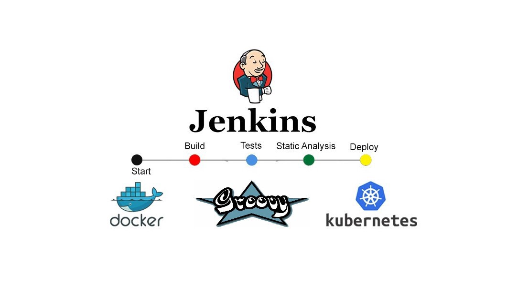

# Creating-a-CI-CD-Build-Pipeline-using-Groovy  

  

Creating a CI/CD Build pipeline using Groovy which will automate the Kubernetes with Jenkins and Jenkins will automatically start the respective language interpreter installed image container to deploy code on top of Kubernetes

### Project Description:  

Perform the task with the help of Jenkins coding file ( called as Jenkins file approach ) and perform with the following phases:  
1. Create container image that’s has Jenkins installed using dockerfile Or You can use the Jenkins Server on RHEL 8/7  
2. When we launch this image, it should automatically start the Jenkins service in the container.  
3. Create a job chain of job1, job2, job3 and job4 using build pipeline plugin in Jenkins  
4. __Job ( Seed Job ):__ Pull the Github repo automatically when some developers push the repo to Github.  
5. Further on jobs should be pipeline using written code using Groovy language by the developer  
6. __Job1 :__  
- By looking at the code or program file, Jenkins should automatically start the respective language interpreter installed image container to deploy code on top of Kubernetes ( eg. If code is of PHP, then Jenkins should start the container that has PHP already installed )
- Expose your pod so that testing team could perform the testing on the pod
- Make the data to remain persistent using PVC ( If server collects some data like logs, other user information )
7. __Job3:__ Test your app if it is working or not.  
8. __Job4:__ if the app is not working, then send email to the developer with error messages and redeploy the application after code is being edited by the developer  

## You can view the full Stepwise Implementation on my blog:  
https://medium.com/@saurabhagarwal43800/creating-a-ci-cd-build-pipeline-using-groovy-73718bfe26e9  

